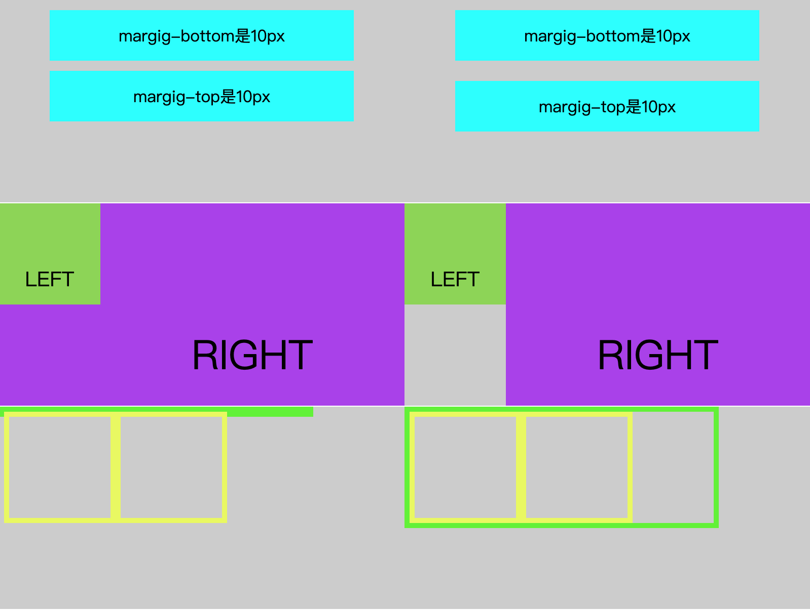

#### **定义**

> BFC 是一个独立的布局环境，其中的元素布局是不受外界的影响，并且在一个 BFC 中，块盒与行盒（行盒由一行中所有的内联元素所组成）都会垂直的沿着其父元素的边框排列。

#### **常见场景**

> - 场景一：上下 p 标签 margin 是 10px,两个标签 margin 重叠，只有 10px 的间距，效果 **实现边距是 20px**
> - 方案：只要给第二个 p 标签外面包裹 div，激活 BFC，并添加 **overflow: hidden;** 即可实现上下边距是 20px。

> - 场景二： 两个 div，一个设置 float 属性，一个不设置宽度，两个 div 会重叠，效果 **实现自适应两栏布局**
> - 方案： 给第二个 div 激活 BFC，并添加 **overflow: hidden;** 即可实现自适应两栏布局。

> - 场景三： 当我们不给父节点设置高度，子节点设置浮动的时候，会发生高度塌陷，这个时候我们就要清楚浮动。效果 **实现清除浮动**
> - 方案： 给父节点激活 BFC，并添加 **overflow: hidden;** 即可实现清除浮动。

```html
<!DOCTYPE html>
<html lang="en">
  <head>
    <meta charset="UTF-8" />
    <meta http-equiv="X-UA-Compatible" content="IE=edge" />
    <meta name="viewport" content="width=device-width, initial-scale=1.0" />
    <title>BFC</title>
  </head>
  <style>
    * {
      margin: 0;
      padding: 0;
    }

    .example-box {
      width: 800px;
      margin: 0 auto;
      background-color: #ccc;
    }

    .example-1,
    .example-2,
    .example-3 {
      width: 800px;
      height: 200px;
      display: flex;
      flex-direction: row;
      border-bottom: 1px solid #fff;
    }

    .example-1-left,
    .example-2-left,
    .example-3-left,
    .example-1-right,
    .example-2-right,
    .example-3-right {
      flex: 1;
    }

    .example-1 .example-1-left p,
    .example-1 .example-1-right p {
      width: 300px;
      height: 50px;
      margin: 10px auto;
      background-color: aqua;
      text-align: center;
      line-height: 50px;
    }

    .example-2 .example-2-left .left,
    .example-2 .example-2-right .left {
      width: 100px;
      height: 100px;
      float: left;
      background: rgb(139, 214, 78);
      text-align: center;
      line-height: 150px;
      font-size: 20px;
    }

    .example-2 .example-2-left .right,
    .example-2 .example-2-right .right {
      height: 200px;
      background: rgb(170, 54, 236);
      text-align: center;
      line-height: 300px;
      font-size: 40px;
    }

    .example-3 .example-3-left .par,
    .example-3 .example-3-right .par {
      border: 5px solid rgb(91, 243, 30);
      width: 300px;
    }

    .child {
      border: 5px solid rgb(233, 250, 84);
      width: 100px;
      height: 100px;
      float: left;
    }
  </style>

  <body>
    <div class="example-box">
      <!-- 场景一 -->
      <div class="example-1">
        <div class="example-1-left">
          <p>margig-bottom是10px</p>
          <p>margig-top是10px</p>
        </div>
        <div class="example-1-right">
          <p>margig-bottom是10px</p>
          <div style="overflow: hidden;">
            <p>margig-top是10px</p>
          </div>
        </div>
      </div>
      <!-- 场景二 -->
      <div class="example-2">
        <div class="example-2-left">
          <div class="left">LEFT</div>
          <div class="right">RIGHT</div>
        </div>
        <div class="example-2-right">
          <div class="left">LEFT</div>
          <div class="right" style="overflow: hidden;">RIGHT</div>
        </div>
      </div>
      <!-- 场景三 -->
      <div class="example-3">
        <div class="example-3-left">
          <div class="par">
            <div class="child"></div>
            <div class="child"></div>
          </div>
        </div>
        <div class="example-3-right">
          <div class="par" style="overflow: hidden;">
            <div class="child"></div>
            <div class="child"></div>
          </div>
        </div>
      </div>
    </div>
  </body>
</html>
```

#### **页面效果**



#### **总结**

:::tip

- BFC 就是页面上的一个隔离的独立容器，容器里面的子元素 不会影响到外面的元素。反之也如此。
- 因为 BFC 内部的元素和外部的元素绝对不会互相影响，因此， 当 BFC 外部存在浮动时，它不应该影响 BFC 内部 Box 的布局，BFC 会通过变窄，而不与浮动有重叠。同样的，当 BFC 内部有浮动时，为了不影响外部元素的布局，BFC 计算高度时会包括浮动的高度。避免 margin 重叠也是这样的一个道理。

:::
