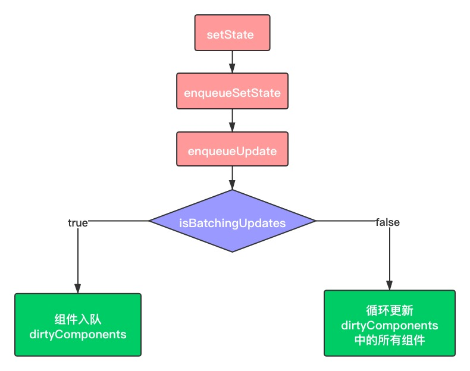
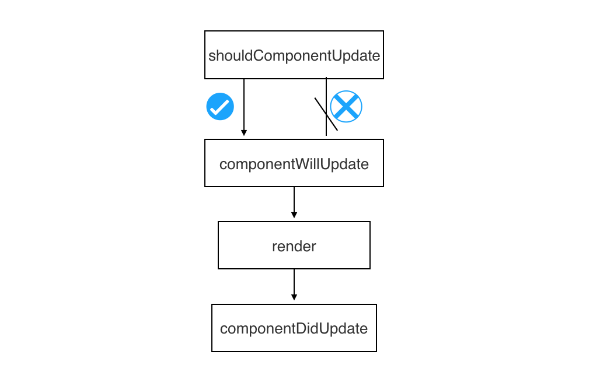
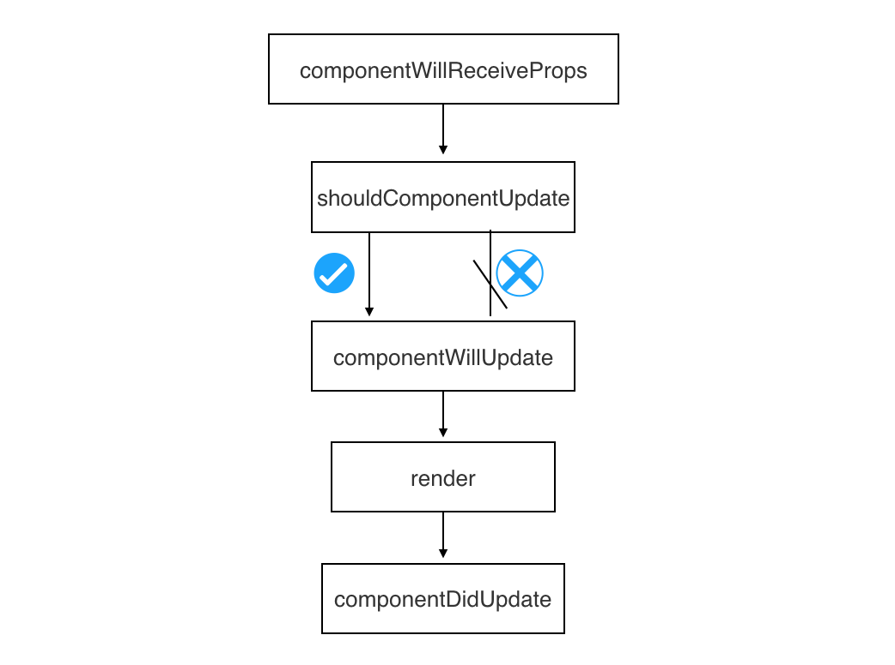
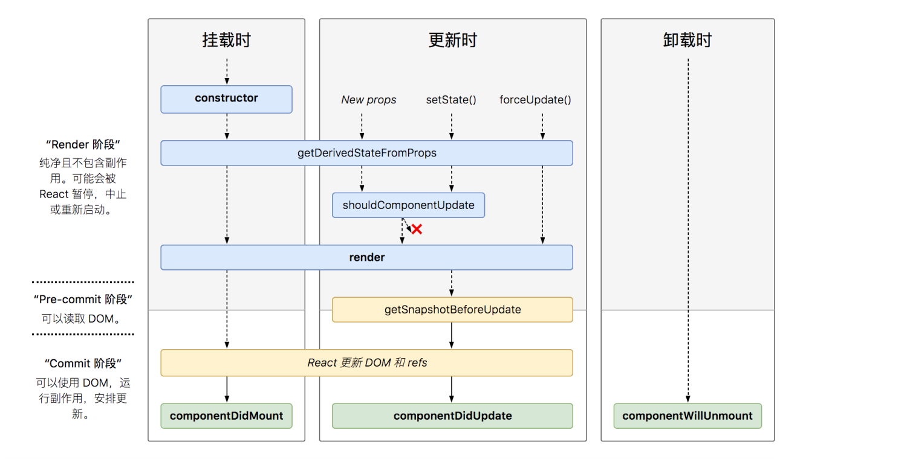

### **_一. 组件基础_**

### **_二. 数据管理_**

#### **1. React setState 调用的原理**



具体的执行过程

- 首先调用 **_setState_** 函数，入口函数在这里就是充当一个分发器的角色，根据入参不同，将其分发到不同的功能函数中

```js
ReactComponent.prototype.setState = function (partialState, callback) {
  this.updater.enqueueSetState(this, partialState);
  if (callback) {
    this.updater.enqueueCallback(this, callback, "setState");
  }
};
```

- **_enqueueSetState_** 方法将新的 **_state_** 放进组件的状态队列里，并调用 **_enqueueUpadate_** 来处理将要更新的实例对象

```js
enqueueSetState:function(publicInstance,partialState) {
  // 根据 this 拿到对应的组件实例
  var internalInstance = getInternalInstanceReadyForUpdate(publicInstance, 'setState');
  // 这个 queue 对应的就是一个组件实例的 state 数组
  var queue = internalInstance._pendingStateQueue || (internalInstance._pendingStateQueue = []);
  queue.push(partialState);
  //  enqueueUpdate 用来处理当前的组件实例
  enqueueUpdate(internalInstance);
}
```

- 在 **_enqueueUpdate_** 方法中引出了一个关键的对象 —— **_batchingStrategy_** ，该对象所具备的 **_isBatchingUpdates_** 属性直接决定了当下是要走更新流程，还是应排队等待；如果轮到执行，就调用**_batchedUpdates_** 方法来直接发起更新流程。由此可推测，**_batchingStrategy_** 或许正是 React 内部专门用于管控批量更新的对象

```js
function enqueueUpdate(component) {
  ensureInjected();
  // 注意这一句是问题的关键，isBatchingUpdates标识着当前是否处于批量创建/更新组件的阶段
  if (!batchingStrategy.isBatchingUpdates) {
    // 若当前没有处于批量创建/更新组件的阶段，则立即更新组件
    batchingStrategy.batchedUpdates(enqueueUpdate, component);
    return;
  }
  // 否则，先把组件塞入 dirtyComponents 队列里，让它“再等等”
  dirtyComponents.push(component);
  if (component._updateBatchNumber == null) {
    component._updateBatchNumber = updateBatchNumber + 1;
  }
}
```

**注意**：batchingStrategy 对象可以理解为“锁管理器”。这里的“锁”，是指 React 全局唯一的 isBatchingUpdates 变量，isBatchingUpdates 的初始值是 false，意味着“当前并未进行任何批量更新操作”。每当 React 调用 batchedUpdate 去执行更新动作时，会先把这个锁给“锁上”（置为 true），表明“现在正处于批量更新过程中”。当锁被“锁上”的时候，任何需要更新的组件都只能暂时进入 dirtyComponents 里排队等候下一次的批量更新，而不能随意“插队”。此处体现的“任务锁”的思想，是 React 面对大量状态仍然能够实现有序分批处理的基石。

#### **2. setState 调用之后发生了什么？是同步还是异步？**

**（1）setState 调用之后发生了什么**

- 在代码中调用 **_setState_** 函数之后，**_React_** 会将传入的参数对象与当前的状态合并，然后触发调和过程（**Reconciliation**）。经过调和过程，**_React_** 会以相对高效的方式根据新的状态构建 **_React_** 元素树，并且着手重新渲染整个 UI 界面。
- 在 **_React_** 得到元素树之后，**_React_** 会计算出新的树与老的树的节点差异，然后根据差异对界面进行最小化重渲染。在差异计算算法中 **_React_** 能够相对精确的知道哪些位置发生了改变以及该如何改变，这就保证了按需更新，而不是全部重新渲染。
- 如果在短时间内频繁 **_setState_**，**_React_** 会将**state**的改变压入栈中，在合适的时机批量更新**state**和视图，达到提高性能的效果

**（2）setState 是同步还是异步**

假如 **_setState_** 是同步的，意味着每执行一次 **_setState_** 时（有可能一个同步代码中，多次 **_setState_** ），都重新 **vnode diff + dom** 修改，这对性能来说是极为不好的。如果是异步，则可以把一个同步代码中的多个 **_setState_** 合并成一次组件更新。所以默认是异步的，但是在一些情况下是同步的。

**_setState_** 并不是单纯同步/异步的，它的表现会根据调用场景的不同而不同。在源码中，通过 **_isBatchingUpdates_** 来判断 **_setState_** 是先存进 **state** 队列还是直接更新，如果值为 **true** 则执行异步操作，如果值为 **false** 则直接更新。

- **异步**：在 **React 可以控制** 的地方，就为 **true**， 比如在 React 生命周期事件和合成事件中，都会走合并操作，延迟更新的策略。
- **同步**：在 **React 无法控制** 的地方，比如原生事件，具体就是在 **addEventListener 、setTimeout、setInterval** 等事件中，就只能同步更新。

一般认为，做异步设计是为了性能优化，减少渲染次数：

- **_setState_** 设计为异步，可以显著提高性能。如果每次调用 **_setState_** 都进行一次更新，那么意味着 **render** 函数会被频繁调用，界面重新渲染，这样效率会很低的；最好的办法就是获得多个更新，之后进行一次更新。
- 如果同步更新了 **state** ，但是还没有执行 **render** 函数，那么 **state** 和 **props** 不能保持同步。**state** 和 **props** 不能保持一致性，开发中会出现很多问题。

#### **3. setState 批量更新的过程是真么？**

调用 **_setState_** 时，组件的 **state** 并不会立即改变，**_setState_** 只是把要修改的 **state** 放入一个队列中，**React** 会优化真正的执行时机，并出去性能原因，会将 **React** 事件处理程序中的多次 **_setState_** 状态修改合并成一次状态修改。最终更新只会产生一次组件的重新渲染，这对于大型应用中的性能提升至关重要。

```js
this.setState({
  count: this.state.count + 1    ===>    入队，[count+1的任务]
});
this.setState({
  count: this.state.count + 1    ===>    入队，[count+1的任务，count+1的任务]
});
                                          ↓
                                         合并 state，[count+1的任务]
                                          ↓
                                         执行 count+1的任务
```

**注意 ⚠️**：只要同步代码还在执行， 攒起来这个动作就不会停止。⬆️ 例子中多次 + 1 ，最终只有一次生效是因为在同一个方法中多次 **_setState_** 的合并动作并不是单纯的将更新累加。比如这里对于相同属性的设置，**React** 这里只会为其保留最后一次的更新。

#### **4. getDefaultProps 怎么使用，有什么作用？**

通过实现组件的 **getDefaultProps** ，对属性设置默认值（ES5 的写法）。

```jsx
var ShowTitle = React.createClass({
  getDefaultProps: function () {
    return {
      title: "React",
    };
  },
  render: function () {
    return <h1>{this.props.title}</h1>;
  },
});
```

#### **5. setState 的第二个参数作用是什么？**

**_setState_** 的第二个参数是一个可选的回调参数。这个回调函数将在组件渲染后执行。等价于在 **componentDidUpdate** 生命周期内执行。通常建议使用 **componentDidUpdate** 来代替此参数。在回调函数中你可以拿到更新后的 **state** 的值：

```js
this.setState({
  key1: newState1,
  key2: newState2,
  ...
}, callback) // 第二个参数是 state 更新完成后的回调函数
```

#### **6. setState 和 replaceState 的区别是什么？**

**(1) setState**

**_setState_** 用于设置状态对象

```js
setState(object nextState[, function callback])
```

- **nextState**: 将要设置的新状态，该状态会和当前的 state 合并
- **callback**: 可选参数，回调函数。该函数会在 setState 设置成功，且组件重新渲染后调用。

合并 **nextState** 和当前 **state**，并重新渲染组件。**setState** 是 **React** 事件处理函数中和请求回调函数中触发 UI 更新的主要方法。

**(2) replaceState**

**_replaceState()_** 方法与 **_setState()_** 类似，但是方法只会保留 **nextState** 中状态，原 **state** 不在 **nextState** 中的状态都会被删除。

```js
replaceState(object nextState[, function callback])
```

- **nextState** :将要设置的新状态，该状态会替换当前的 state。
- **callback** : 可选参数，回调函数。该函数会在 replaceState 设置成功，且组件重新渲染后调用。

**总结：** **_setState_** 是修改其中的部分状态，相当于 **_Object.assign_** ，只是覆盖，不会减少原来的状态。而 **_replaceState_** 是完全替换原来的状态，相当于赋值，将原来的 **state** 替换为另一个对象，如果新状态属性减少，那么 **state** 中就没有这个状态了。

#### **7. 组件的 this.state 和 this.setState 有什么区别？**

**this.state** 通常是用来初始化 **state** 的，**this.setState** 是用来修改 **state** 值的。如果初始化了 **state** ，再使用 **this.state** ，之前 **state** 的值是会被覆盖，如果使用 **this.setState** ，只会替换掉相应的 **state**。所以如果想修改 **state** 的值，必须使用 **this.setState** ，直接修改 **state** 之后页面是不会刷新的。

#### **8. 组件的 state 和 props 有什么区别？**

- **props** ：是一个从外部传进组件的参数，主要作用就是从父组件向子组件传递数据，它具有可读性和不变性，只能通过外部组件主动传入新的 **props** 来重新渲染子组件，否则子组件的 **props** 以及展现形式不会改变。
- **state** ：主要作用用于组件保存、控制以及修改自己的状态，它只能在 **constructor** 中初始化，它算是组件的私有属性，不可通过外部访问和修改，只能通过组件内部的 **this.setState** 来修改，修改 **state** 会导致组件的重新渲染
- **区别** ：
  - **props** 是传递给组件的（类似于函数的形参），而 **state** 是在组件内被组件自己管理的（类似于在一个函数内声明的变量）。
  - **props** 是不可修改的，所有 **React** 组件都必须像纯函数一样保护它们的 **props** 不被更改。
  - **state** 是在组件中创建的，一般在 **constructor** 中初始化 **state** 。**state** 是多变的、可以修改，每次 **setState** 都异步更新的。

#### **9. props 为什么是只读的？**

**_this.props_** 是组件之间沟通的一个接口，原则上讲，它只能父组件流向子组件。**React** 具有浓重的函数式编程的思想。
函数式编程有一个特别的概念：**_纯函数_**

- 给定相同的输入，总是返回相同的输出
- 过程没有副作用
- 不依赖外部状态

**_this.props_** 就是吸取了纯函数的思想，**props** 的不可变性就保证了相同的输入，页面显示的内容是一样的，并且不会产生副作用

#### **10. 组件的 props 改变时更新组件的有哪些方法？**

在一个组件传入的 **props** 更新时重新渲染该组件常用的方法是在 **_componentWillReceiveProps_** 中将新的 **props** 更新到组件的 **state** 中（这种 **state** 被成为派生状态（ **Derived State** ），从而实现重新渲染。React 16.3 中还引入了一个新的钩子函数 **getDerivedStateFromProps** 来专门实现这一需求。

**（1）componentWillReceiveProps（已废弃）**

在 react 的 **_componentWillReceiveProps(nextProps)_** 生命周期中，可以在子组件的 **render** 函数执行前，通过 **this.props** 获取旧的属性，通过 **nextProps** 获取新的 **props**，对比两次 **props** 是否相同，从而更新子组件自己的 **state**。

这样的好处是，可以将数据请求放在这里进行执行，需要传的参数则从 **_componentWillReceiveProps(nextProps)_** 中获取。而不必将所有的请求都放在父组件中。于是该请求只会在该组件渲染时才会发出，从而减轻请求负担。

**（2）getDerivedStateFromProps（16.3 引入）**

这个生命周期函数是为了替代 **_componentWillReceiveProps_** 存在的，所以在需要使用 **_componentWillReceiveProps_** 时，就可以考虑使用 **_getDerivedStateFromProps_** 来进行替代。

两者的参数是不相同的，而 **_getDerivedStateFromProps_** 是一个静态函数，也就是这个函数不能通过 **_this_** 访问到 **class** 的属性，也并不推荐直接访问属性。而是应该通过参数提供的 **nextProps** 以及 **prevState** 来进行判断，根据新传入的 **props** 来映射到 **state**。

需要注意的是，如果 **props** 传入的内容不需要影响到你的 **state**，那么就需要返回一个 **null**，这个返回值是必须的，所以尽量将其写到函数的末尾：

```jsx
static getDerivedStateFromProps(nextProps, prevState) {
    const {type} = nextProps;
    // 当传入的type发生变化的时候，更新state
    if (type !== prevState.type) {
        return {
            type,
        };
    }
    // 否则，对于state不进行任何操作
    return null;
}
```

#### **11. 怎么检验 props？验证 props 的目的是什么？**

**React** 为我们提供了 **_PropTypes_** 以供验证使用。当我们向 **Props** 传入的数据无效（向 **Props** 传入的数据类型和验证的数据类型不符）就会在控制台发出警告信息。它可以避免随着应用越来越复杂从而出现的问题。并且，它还可以让程序变得更易读。

```jsx
import PropTypes from "prop-types";

class Greeting extends React.Component {
  render() {
    return <h1>Hello, {this.props.name}</h1>;
  }
}

Greeting.propTypes = {
  name: PropTypes.string,
};
```

如果项目中使用了 **TypeScript**，那么就可以不用 **PropTypes** 来校验，而使用 **TypeScript** 定义 **_接口_** 来校验 **props**。

#### **12. state 是怎么注入到组件的，从 reducer 到组件经历了什么样的过程**

通过 **_connect_** 和 **_mapStateToProps_** 将 **state** 注入到组件中

```jsx
import { connect } from "react-redux";
import { setVisibilityFilter } from "@/reducers/Todo/actions";
import Link from "@/containers/Todo/components/Link";

const mapStateToProps = (state, ownProps) => ({
  active: ownProps.filter === state.visibilityFilter,
});

const mapDispatchToProps = (dispatch, ownProps) => ({
  setFilter: () => {
    dispatch(setVisibilityFilter(ownProps.filter));
  },
});

export default connect(mapStateToProps, mapDispatchToProps)(Link);
```

上面代码中，**active** 就是注入到 **Link** 组件中的状态。 **_mapStateToProps（state，ownProps）_** 中带有两个参数，含义是 ∶

- **state-store** 管理的全局状态对象，所有都组件状态数据都存储在该对象中。
- **ownProps** 组件通过 **props** 传入的参数。

**reducer 到组件经历的过程：**

- **reducer** 对 **action** 对象处理，更新组件状态，并将新的状态值返回 **store**。
- 通过 **connect（mapStateToProps，mapDispatchToProps）（Component）** 对组件 **Component** 进行升级，此时将状态值从 **store** 取出并作为 **props** 参数传递到组件。

**高阶组件实现源码 ∶**

```jsx
import React from "react";
import PropTypes from "prop-types";

// 高阶组件 contect
export const connect =
  (mapStateToProps, mapDispatchToProps) => (WrappedComponent) => {
    class Connect extends React.Component {
      // 通过对context调用获取store
      static contextTypes = {
        store: PropTypes.object,
      };

      constructor() {
        super();
        this.state = {
          allProps: {},
        };
      }

      // 第一遍需初始化所有组件初始状态
      componentWillMount() {
        const store = this.context.store;
        this._updateProps();
        store.subscribe(() => this._updateProps()); // 加入_updateProps()至store里的监听事件列表
      }

      // 执行action后更新props，使组件可以更新至最新状态（类似于setState）
      _updateProps() {
        const store = this.context.store;
        let stateProps = mapStateToProps
          ? mapStateToProps(store.getState(), this.props)
          : {}; // 防止 mapStateToProps 没有传入
        let dispatchProps = mapDispatchToProps
          ? mapDispatchToProps(store.dispatch, this.props)
          : {
              dispatch: store.dispatch,
            }; // 防止 mapDispatchToProps 没有传入
        this.setState({
          allProps: {
            ...stateProps,
            ...dispatchProps,
            ...this.props,
          },
        });
      }

      render() {
        return <WrappedComponent {...this.state.allProps} />;
      }
    }
    return Connect;
  };
```

### **_三. 生命周期_**

#### **1. React 的生命周期有哪些？**

**React** 通常将组件生命周期分为三个阶段

- 装载阶段（ **_Mount_** ），组件第一次在 **DOM** 树中被渲染
- 更新过程（ **_Update_** ），组件状态发生改变，重新更新渲染的过程
- 卸载过程（ **_Unmount_** ），组件从 **DOM** 树中被移除的过程
  

**1）组件挂载阶段**

挂载阶段组件被创建，然后组件实例插入到 **DOM** 中，完成组件的第一次渲染，该过程只会发生一次，在此阶段会依次调用以下这些方法：

- **constructor**
- **getDerivedStateFromProps**
- **render**
- **componentDidMount**

**分析**

- **constructor**

  组件的构造函数，第一个被执行，若没有显式定义它，会有一个默认的构造函数，但是若显式定义了构造函数，我们必须在构造函数中执行 **super(props)**，否则无法在构造函数中拿到 **_this_**。

  如果不初始化 **state** 或不进行方法绑定，则不需要为 **React** 组件实现构造函数 **_Constructor_**。

  **constructor** 只做两件事：

  - 初始化组件的 **state**
  - 给事件处理方法绑定 **this**

  ```js
  constructor(props) {
    super(props);
    // 不要在构造函数中调用 setState，可以直接给 state 设置初始值
    this.state = { counter: 0 }
    this.handleClick = this.handleClick.bind(this)
  }
  ```

- **getDerivedStateFromProps**

  ```js
  static getDerivedStateFromProps(props, state)
  ```

  这是个静态方法，所以不能在这个函数里使用 **this**，有两个参数 **props** 和 **state**，分别指接收到的新参数和当前组件的 **state**对象，这个函数会返回一个对象用来更新当前的 **state** 对象，如果不需要更新可以返回 **null**。

  该函数会在装载时，接收到新的 **props** 或者调用了 **setStat**e 和 **forceUpdate** 时被调用。如当接收到新的属性想修改 **state** ，就可以使用。

  ```jsx
  // 当 props.counter 变化时，赋值给 state
  class App extends React.Component {
    constructor(props) {
      super(props);
      this.state = {
        counter: 0,
      };
    }
    static getDerivedStateFromProps(props, state) {
      if (props.counter !== state.counter) {
        return {
          counter: props.counter,
        };
      }
      return null;
    }

    handleClick = () => {
      this.setState({
        counter: this.state.counter + 1,
      });
    };
    render() {
      return (
        <div>
          <h1 onClick={this.handleClick}>Hello, world!{this.state.counter}</h1>
        </div>
      );
    }
  }
  ```

  现在可以显式传入 counter ，但是这里有个问题，如果想要通过点击实现 state.counter 的增加，但这时会发现值不会发生任何变化，一直保持 props 传进来的值。这是由于在 React 16.4^ 的版本中 **setState** 和 **forceUpdate** 也会触发这个生命周期，所以当组件内部 state 变化后，就会重新走这个方法，同时会把 state 值赋值为 props 的值。因此需要多加一个字段来记录之前的 props 值，这样就会解决上述问题。具体如下：

  ```jsx
  // 这里只列出需要变化的地方
  class App extends React.Component {
    constructor(props) {
      super(props);
      this.state = {
        // 增加一个 preCounter 来记录之前的 props 传来的值
        preCounter: 0,
        counter: 0,
      };
    }
    static getDerivedStateFromProps(props, state) {
      // 跟 state.preCounter 进行比较
      if (props.counter !== state.preCounter) {
        return {
          counter: props.counter,
          preCounter: props.counter,
        };
      }
      return null;
    }
    handleClick = () => {
      this.setState({
        counter: this.state.counter + 1,
      });
    };
    render() {
      return (
        <div>
          <h1 onClick={this.handleClick}>Hello, world!{this.state.counter}</h1>
        </div>
      );
    }
  }
  ```

- **render**

  **_render_** 是 React 中最核心的方法，一个组件中必须要有这个方法，它会根据状态 state 和属性 props 渲染组件。这个函数只做一件事，就是返回需要渲染的内容，所以不要在这个函数内做其他业务逻辑，通常调用该方法会返回以下类型中一个：

  - **React 元素** : 这里包括原生的 DOM 以及 React 组件
  - **数组和 Fragment（片段）** : 可以返回多个元素
  - **Portals（插槽）** : 可以将子元素渲染到不同的 DOM 子树种
  - **字符串和数字** : 被渲染成 DOM 中的 text 节点
  - **布尔值或 null** : 不渲染任何内容

- **componentDidMount**

  **_componentDidMount()_** 会在组件挂载后（插入 DOM 树中）立即调。该阶段通常进行以下操作：

  - 执行依赖于 DOM 的操作
  - 发送网络请求；（官方建议）
  - 添加订阅消息（会在 componentWillUnmount 取消订阅）

  如果在 **_componentDidMount_** 中调用 **_setState_** ，就会触发一次额外的渲染，多调用了一次 **_render_** 函数，由于它是在浏览器刷新屏幕前执行的，所以用户对此是没有感知的，但是应当避免这样使用，这样会带来一定的性能问题，尽量是在 **constructor** 中初始化 **state** 对象。

  在组件装载之后，将计数数字变为 1：

  ```jsx
  class App extends React.Component {
    constructor(props) {
      super(props);
      this.state = {
        counter: 0,
      };
    }
    componentDidMount() {
      this.setState({
        counter: 1,
      });
    }
    render() {
      return <div className="counter">counter值: {this.state.counter}</div>;
    }
  }
  ```

**2）组件更新阶段**

当组件的 **props** 改变了，或组件内部调用了 **_setState/forceUpdate_**，会触发更新重新渲染，这个过程可能会发生多次。这个阶段会依次调用下面这些方法：

- **_getDerivedStateFromProps_**
- **_shouldComponentUpdate_**
- **_render_**
- **_getSnapshotBeforeUpdate_**
- **_componentDidUpdate_**

**（1）shouldComponentUpdate**

```js
shouldComponentUpdate(nextProps, nextState);
```

**注意 ⚠️**

- **_setState_** 函数在任何情况下都会导致组件重新渲染吗？例如：

```js
this.setState({ number: this.state.number });
```

- 如果没有调用 **_setState_**，**props** 值也没有变化，是不是组件就不会重新渲染？

第一个问题答案是 **会**，第二个问题如果是父组件重新渲染时，不管传入的 **props** 有没有变化，都会引起子组件的重现渲染。

那么有没有什么方法解决在这两个场景下不让组件重新渲染而提升性能呢？ 这个时候 **_shouldComponentUpdate_** 就登场了，这个生命周期函数是用来提升速度的，它是在重现渲染组件开始前触发的，默认返回 **true**，可以比较 **this.props** 和 **nextProps**，**this.state** 和 **nextState** 值是否变化，来确认返回 **true** 或者 **false** 。当返回 **false** 时，组件的更新过程停止，后续的 **render\*** 、**_componentDidUpdate_** 也不会被调用。

**注意 ⚠️**：添加 **_shouldComponentUpdate_** 方法时，不建议使用深度相等检查（如使用 **_JSON.stringify（）_** ），因为深比效率比较低，可能会比重新渲染组件效率还低。而且 gai 该方法维护比较困难，建议使用该方法会产生明显的性能提升时使用。

**（2）getSnapshotBeforeUpdate**

```js
getSnapshotBeforeUpdate(prevProps, prevState);
```

这个方法在 **_render_** 之后，**_componentDidUpdate_** 之前调用，有两个参数 **prevProps** 和 **prevState** ，表示更新之前的 **props** 和 **state**，这个函数必须要和 **_componentDidUpdate_** 一起使用，并且要有一个返回值，默认是 **null**，这个返回值作为第三个参数传给 **_componentDidUpdate_**。

**（3）componentDidUpdate**

**_componentDidUpdate()_** 会在更新后会被立即调用，首次渲染不会执行此方法。 该阶段通常进行以下操作：

- 当组件更新后，对 DOM 进行操作
- 如果你对更新前后的 props 进行了比较，也可以选择在此处进行网络请求；（例如，当 props 未发生变化时，则不会执行网络请求）。

```js
componentDidUpdate(prevProps, prevState, snapshot){}
```

- **prevProps**: 更新前的 **props**
- **prevState**: 更新前的 **state**
- **snapshot**: **_getSnapshotBeforeUpdate()_** 生命周期的返回值

**3）组件卸载阶段**

卸载阶段只有一个生命周期函数，**_componentWillUnmount()_** 会在组件卸载及销毁之前直接调用。在此方法中执行必要的清理操作：

- 清除 timer，取消网络请求或清除
- 取消在 **_componentDidMount()_** 中创建的订阅等；

这个生命周期在一个组件被卸载和销毁之前被调用，因此你不应该再这个方法中使用 setState，因为组件一旦被卸载，就不会再装载，也就不会重新渲染。

**4）错误处理阶段**

**_componentDidCatch(error, info)_**，此生命周期在后代组件抛出错误后被调用。 它接收两个参数 ∶

- **error**：抛出的错误
- **info**：带有 **componentStack key**的对象，其中包含有关组件引发错误的栈信息


**React 常见生命周期的过程大致如下：**

- 挂载阶段，首先执行 constructor 构造方法，来创建组件
- 创建完成之后，就会执行 render 方法，该方法会返回需要渲染的内容
- 随后，React 会将需要渲染的内容挂载到 DOM 树上
- **挂载完成之后就会执行 componentDidMount 生命周期函数**
- 如果我们给组件创建一个 props（用于组件通信）、调用 setState（更改 state 中的数据）、调用 forceUpdate（强制更新组件）时，都会重新调用 render 函数
- render 函数重新执行之后，就会重新进行 DOM 树的挂载
- **挂载完成之后就会执行 componentDidUpdate 生命周期函数**
- **当移除组件时，就会执行 componentWillUnmount 生命周期函数**

**React 主要生命周期总结：**

- **_getDefaultProps_** : 这个函数会在组件创建之前被调用一次（有且仅有一次），它被用来初始化组件的 Props
- **_getInitialState_** : 用于初始化组件的 state 值
- **_componentWillMount_** : 在组件创建后、render 之前，会走到 componentWillMount 阶段。这个阶段我个人一直没用过、非常鸡肋。后来 React 官方已经不推荐大家在 componentWillMount 里做任何事情、到现在 **React16 直接废弃了这个生命周期** ，足见其鸡肋程度了
- **_render_** : 这是所有生命周期中唯一一个你必须要实现的方法。一般来说需要返回一个 jsx 元素，这时 React 会根据 props 和 state 来把组件渲染到界面上；不过有时，你可能不想渲染任何东西，这种情况下让它返回 null 或者 false 即可
- **_componentDidMount_** : 会在组件挂载后（插入 DOM 树中后）立即调用，标志着组件挂载完成。一些操作如果依赖获取到 DOM 节点信息，我们就会放在这个阶段来做。此外，这还是 React 官方推荐的发起 ajax 请求的时机。该方法和 componentWillMount 一样，有且仅有一次调用

#### **2. React 废弃了哪些生命周期？为什么？**

被废弃的三个函数都是在 render 之前，因为 fber 的出现，很可能因为高优先级任务的出现而打断现有任务导致它们会被执行多次。另外的一个原因则是，React 想约束使用者，好的框架能够让人不得已写出容易维护和扩展的代码，这一点又是从何谈起，可以从新增加以及即将废弃的生命周期分析入手

- **_componentWillMount_**

首先这个函数的功能完全可以使用 componentDidMount 和 constructor 来代替，异步获取的数据的情况上面已经说明了，而如果抛去异步获取数据，其余的即是初始化而已，这些功能都可以在 constructor 中执行，除此之外，如果在 willMount 中订阅事件，但在服务端这并不会执行 willUnMount 事件，也就是说服务端会导致内存泄漏所以 componentWilIMount 完全可以不使用，但使用者有时候难免因为各 种各样的情况在 componentWilMount 中做一些操作，那么 React 为了约束开发者，干脆就抛掉了这个 API

- **_componentWillReceiveProps_**

在老版本的 React 中，如果组件自身的某个 state 跟其 props 密切相关的话，一直都没有一种很优雅的处理方式去更新 state，而是需要在 componentWilReceiveProps 中判断前后两个 props 是否相同，如果不同再将新的 props 更新到相应的 state 上去。这样做一来会破坏 state 数据的单一数据源，导致组件状态变得不可预测，另一方面也会增加组件的重绘次数。类似的业务需求也有很多，如一个可以横向滑动的列表，当前高亮的 Tab 显然隶属于列表自身的时，根据传入的某个值，直接定位到某个 Tab。为了解决这些问题，React 引入了第一个新的生命周期：getDerivedStateFromProps。
:::tip
**_getDerivedStateFromProps_** 有以下的优点 ∶

- getDSFP 是静态方法，在这里不能使用 this，也就是一个纯函数，开发者不能写出副作用的代码
- 开发者只能通过 prevState 而不是 prevProps 来做对比，保证了 state 和 props 之间的简单关系以及不需要处理第一次渲染时 prevProps 为空的情况
- 基于第一点，将状态变化（setState）和昂贵操作（tabChange）区分开，更加便于 render 和 commit 阶段操作或者说优化

:::

- **_componentWillUpdate_**

与 componentWillReceiveProps 类似，许多开发者也会在 componentWillUpdate 中根据 props 的变化去触发一些回调 。 但不论是 componentWilReceiveProps 还 是 componentWilUpdate，都有可能在一次更新中被调用多次，也就是说写在这里的回调函数也有可能会被调用多次，这显然是不可取的。与 componentDidMount 类 似， componentDidUpdate 也不存在这样的问题，一次更新中 componentDidUpdate 只会被调用一次，所以将原先写在 componentWillUpdate 中 的 回 调 迁 移 至 componentDidUpdate 就可以解决这个问题.

另外一种情况则是需要获取 DOM 元素状态，但是由于在 fber 中，render 可打断，可能在 wilMount 中获取到的元素状态很可能与实际需要的不同，这个通常可以使用第二个新增的生命函数的解决 getSnapshotBeforeUpdate(prevProps, prevState)

- **_getSnapshotBeforeUpdate(prevProps, prevState)_**

返回的值作为 componentDidUpdate 的第三个参数。与 willMount 不同的是，getSnapshotBeforeUpdate 会在最终确定的 render 执行之前执行，也就是能保证其获取到的元素状态与 didUpdate 中获取到的元素状态相同。官方参考代码：

```jsx
class ScrollingList extends React.Component {
  constructor(props) {
    super(props);
    this.listRef = React.createRef();
  }

  getSnapshotBeforeUpdate(prevProps, prevState) {
    // 我们是否在 list 中添加新的 items ？
    // 捕获滚动​​位置以便我们稍后调整滚动位置。
    if (prevProps.list.length < this.props.list.length) {
      const list = this.listRef.current;
      return list.scrollHeight - list.scrollTop;
    }
    return null;
  }

  componentDidUpdate(prevProps, prevState, snapshot) {
    // 如果我们 snapshot 有值，说明我们刚刚添加了新的 items，
    // 调整滚动位置使得这些新 items 不会将旧的 items 推出视图。
    //（这里的 snapshot 是 getSnapshotBeforeUpdate 的返回值）
    if (snapshot !== null) {
      const list = this.listRef.current;
      list.scrollTop = list.scrollHeight - snapshot;
    }
  }

  render() {
    return <div ref={this.listRef}>{/* ...contents... */}</div>;
  }
}
```

#### **3. React 16.X 中 props 改变后在哪个生命周期中处理**

**在 getDerivedStateFromProps 中进行处理**

这个生命周期函数是为了替代 componentWillReceiveProps 存在的，所以在需要使用 componentWillReceiveProps 时，就可以考虑使用 getDerivedStateFromProps 来进行替代。

两者的参数是不相同的，而 getDerivedStateFromProps 是一个静态函数，也就是这个函数不能通过 this 访问到 class 的属性，也并不推荐直接访问属性。而是应该通过参数提供的 nextProps 以及 prevState 来进行判断，根据新传入的 props 来映射到 state。

需要注意的是，**如果 props 传入的内容不需要影响到你的 state，那么就需要返回一个 null**，这个返回值是必须的，所以尽量将其写到函数的末尾：

```jsx
static getDerivedStateFromProps(nextProps, prevState) {
    const {type} = nextProps;
    // 当传入的type发生变化的时候，更新state
    if (type !== prevState.type) {
        return {
            type,
        };
    }
    // 否则，对于state不进行任何操作
    return null;
}
```

#### **4. React 性能优化在哪个生命周期？它优化的原理是什么？**

react 的父级组件的 render 函数重新渲染会引起子组件的 render 方法的重新渲染。但是，有的时候子组件的接受父组件的数据没有变动。子组件 render 的执行会影响性能，这时就可以使用 shouldComponentUpdate 来解决这个问题。

使用方法如下：

```jsx
shouldComponentUpdate(nexrProps) {
    if (this.props.num === nexrProps.num) {
        return false
    }
    return true;
}
```

shouldComponentUpdate 提供了两个参数 nextProps 和 nextState，表示下一次 props 和一次 state 的值，当函数返回 false 时候，render()方法不执行，组件也就不会渲染，返回 true 时，组件照常重渲染。此方法就是拿当前 props 中值和下一次 props 中的值进行对比，数据相等时，返回 false，反之返回 true。

需要注意，在进行新旧对比的时候，是浅对比，也就是说如果比较的数据时引用数据类型，只要数据的引用的地址没变，即使内容变了，也会被判定为 true。

面对这个问题，可以使用如下方法进行解决：
（1）使用 setState 改变数据之前，先采用 ES6 中 assgin 进行拷贝，但是 assgin 只深拷贝的数据的第一层，所以说不是最完美的解决办法：

```js
const o2 = Object.assign({}, this.state.obj);
o2.student.count = "00000";
this.setState({
  obj: o2,
});
```

（2）使用 JSON.parse(JSON.stringfy())进行深拷贝，但是遇到数据为 undefined 和函数时就会错。

```js
const o2 = JSON.parse(JSON.stringify(this.state.obj));
o2.student.count = "00000";
this.setState({
  obj: o2,
});
```

#### **4. state 和 props 触发更新的生命周期分别有什么区别？**

- **state**
  

  - **_shouldComponentUpdate_** : 当组件的 **state** 和 **props** 发生改变时，都会首先触发这个生命周期函数。它会接收两个参数 **nextState** 和 **nextProps** ，它们分别代表传入的新的 **state** 和 **props** 值。拿到这两个值以后，我们就可以通过一些逻辑来决定是否有 **re-render（重渲染）** 的必要了，如果该函数的返回值为 **false** ，则生命周期终止，反之继续
    :::warning

    **注意 ⚠️**

    此方法仅作为性能优化的方式而存在。不要企图依靠此方法来“阻止”渲染，因为这可能会产生 bug。应该考虑使用内置的 **PureComponent** 组件，而不是手动编写 **_shouldComponentUpdate()_**

    :::

  - **_componentWillUpdate_**

    当组件的 state 或 props 发生改变时，会在渲染之前调用 componentWillUpdate。componentWillUpdate 是 **React16 废弃的三个生命周期之一**。过去，我们可能希望能在这个阶段去收集一些必要的信息（比如更新前的 DOM 信息等等），现在我们完全可以在 React16 的 getSnapshotBeforeUpdate 中去做这些事；

  - **_componentDidUpdate_**

    componentDidUpdate() 会在 UI 更新后会被立即调用。它接收 prevProps（上一次的 props 值）作为入参，也就是说在此处我们仍然可以进行 props 值对比（再次说明 componentWillUpdate 确实鸡肋哈）。

- **props**
  
  相对于 state 更新，props 更新后唯一的区别是增加了对 **_componentWillReceiveProps_** 的调用。关于 componentWillReceiveProps，需要知道这些事情：

  - **_componentWillReceiveProps_**

  它在 Component 接受到新的 props 时被触发。componentWillReceiveProps 会接收一个名为 nextProps 的参数（对应新的 props 值）。该生命周期是 **React16 废弃掉的三个生命周期之一**。在它被废弃前，可以用它来比较 this.props 和 nextProps 来重新 setState。在 React16 中，用一个类似的新生命周期 getDerivedStateFromProps 来代替它。

#### **6. React 中发起网络请求应该在哪个生命周期中进行？为什么？**

对于**异步请求**，最好放在 **_componentDidMount_** 中去操作，对于**同步的状态改变**，可以放在 **componentWillMount** 中，一般用的比较少。

如果认为在 **_componentWillMount_** 里发起请求能提早获得结果，这种想法其实是错误的，通常 **componentWillMount 比 componentDidMount 早不了多少微秒**，网络上任何一点延迟，这一点差异都可忽略不计。

**react 的生命周期**：**_constructor()_** -> **_componentWillMount()_** -> **_render()_** -> **_componentDidMount()_**

上面这些方法的调用是有次序的，由上而下依次调用

- constructor 被调用是在组件准备要挂载的最开始，此时组件尚未挂载到网页上。
- componentWillMount 方法的调用在 constructor 之后，在 render 之前，在这方法里的代码调用 setState 方法不会触发重新 render，所以它一般不会用来作加载数据之用。
- componentDidMount 方法中的代码，是在组件已经完全挂载到网页上才会调用被执行，所以可以保证数据的加载。此外，在这方法中调用 setState 方法，会触发重新渲染。所以，官方设计这个方法就是用来加载外部数据用的，或处理其他的副作用代码。与组件上的数据无关的加载，也可以在 constructor 里做，但 constructor 是做组件 state 初绐化工作，并不是做加载数据这工作的，constructor 里也不能 setState，还有加载的时间太长或者出错，页面就无法加载出来。所以有副作用的代码都会集中在 componentDidMount 方法里。

**总结：**

- 跟服务器端渲染（同构）有关系，如果在 componentWillMount 里面获取数据，fetch data 会执行两次，一次在服务器端一次在客户端。在 componentDidMount 中可以解决这个问题，componentWillMount 同样也会 render 两次。
- 在 componentWillMount 中 fetch data，数据一定在 render 后才能到达，如果忘记了设置初始状态，用户体验不好。
- react16.0 以后，componentWillMount 可能会被执行多次。

#### **7. React 16 中新生命周期有哪些**


可以看出，React16 自上而下地对生命周期做了另一种维度的解读：

- **Render 阶段** : 用于计算一些必要的状态信息。这个阶段可能会被 React 暂停，这一点和 React16 引入的 Fiber 架构（我们后面会重点讲解）是有关的
- **Pre-commit 阶段** : 所谓“commit”，这里指的是“更新真正的 DOM 节点”这个动作。所谓 Pre-commit，就是说我在这个阶段其实还并没有去更新真实的 DOM，不过 DOM 信息已经是可以读取的了
- **Commit 阶段** : 在这一步，React 会完成真实 DOM 的更新工作。Commit 阶段，我们可以拿到真实 DOM（包括 refs）

与此同时，新的生命周期在流程方面，仍然遵循 **挂载**、**更新**、**卸载**这三个广义的划分方式。它们分别对应到：

- 挂载过程
  - **_constructor_**
  - **_getDerivedStateFromProps_**
  - **_render_**
  - **_componentDidMount_**
- 更新过程
  - **_getDerivedStateFromProps_**
  - **_shouldComponentUpdate_**
  - **render**
  - **_getSnapshotBeforeUpdate_**
  - **_componentDidUpdate_**
- 卸载过程
  - **_componentWillUnmount_**

### **_四. 组件通信_**

#### **1. 父子组件的通信方式**

- 父组件向子组件通信：**父组件通过 props 向子组件传递需要的信息**

```jsx
// 子组件
const Child = (props) => <span>{props.name}</span>;
// 父组件
const Parent = () => <Child name="react" />;
```

- 子组件向父组件通信：**props + 回调函数方式传递信息**

```jsx
// 子组件
const Child = (props) => {
  const cb = (info) => props.callback(info);
  return <span onClick={() => cb("hi")}>{props.name}</span>;
};
// 父组件
const Parent = () => {
  const callback = (info) => {
    console.log(info); // hi
  };
  return <Child name="react" callback={callback} />;
};
```

#### **2. 跨级组件的通信方式**

父组件向子组件的子组件传递信息

- 使用 **_props_**，利用中间组件层层传递，但是如果父组件结构较深，那么中间每一层组件都要去传递 props，增加了复杂度，并且这些 props 并不是中间组件需要的
- 使用 **_context_**，context 相当于一个大容器，可以把要通信的内容放在容器中，这样不管嵌套多深，都可以随意取用，对于跨越多层的全局数据可以使用 context 实现

[context 实现组件通信原理](../react/context.md)

#### **3. 非嵌套关系组件的通信方式**

**非嵌套关系组件**是指没有任何包含关系的组件，包括兄弟组件以及不在同一个父级组件中的非兄弟组件

- 可以通过自定义事件通信（发布订阅模式）
- 可以通过 Redux 等进行全局状态管理
- 如果是兄弟组件通信，可以找到这两个兄弟节点共同的父节点，结合父子组件的通信方式进行通信

#### **4. 如何解决 props 层级过深的问题**

- 使用 **context API** ：提供一种组件之间的状态共享，而不必通过显式组件树逐层传递 **props**
- 使用 **Redux** 等状态库

#### **5. 组件通信的方式有哪些**

- **父组件向子组件通信**：父组件可以向子组件通过**_props_**的方式，向子组件通信
- **子组件向父组件通信**：**_props+回调函数_**的方式，父组件向子组件传递**props**进行通讯，次**props**作用域为父组件自身的函数，子组件调用该函数，将子组件想要传递的信息，作为参数传递给父组件
- **兄弟组件通信**： 找到这两个兄弟节点共同的父节点，结合上面的两种方式由父节点转发信息进行通信
- **跨层级通信**：**_Context_**设计目的是为了共享那些对于一个组件树而言是**全局**的数据，例如当前认证用户、主题或首选语言、对于跨越多层的全局数据通过**Context**通信再适合不过
- **发布订阅模式**：发布者发布事件，订阅监听事件并做出反应，我们可以引入 **event**模块进行通信
- **全局状态管理工具**：借助**_Redux_**或**_Mobx_**等全局状态管理工具进行通信，这种工具会维护一个全局中心的**_Store_**，并根据不同的事件产生新的状态

### **_五. 路由_**

#### **1. React-Router 的实现原理是什么？**

**客户端路由实现的思想**：

- 基于 **hash** 的路由：通过监听 **hashchange** 事件，感知 **hash** 的变化
  - 改变 hash 可以直接通过 **location.hash=xxx**
- 基于 H5 **history** 路由

  - 改变 url 可以通过 **_history.pushState_** 和 **_resplaceState_** 等，会将 URL 压入堆栈，同时能够应用 **_history.go()_** 等 API
  - 监听 url 的变化可以通过自定义事件触发实现

**react-router 实现的思想**：

- 基于 **history** 库来实现上述不同的客户端路由实现思想，并且能够保存历史记录等，磨平浏览器差异，上层无感知
- 通过维护的列表，在每次 URL 发生变化的回收，通过配置的 路由路径，匹配到对应的 **Component**，并且 **_render_**

#### **2. 如何配置 React-Router 实现路由切换**

**（1）使用 Route 组件**
路由匹配是通过比较 **Route** 的 **path** 属性和当前地址的 **pathname** 来实现的。当一个 **Route** 匹配成功时，它将渲染其内容，当它不匹配时就会渲染 **null** 。没有路径的 **Route** 始终被匹配。

```jsx
// when location = { pathname: '/about' }
<Route path='/about' component={About}/> // renders <About/>
<Route path='/contact' component={Contact}/> // renders null
<Route component={Always}/> // renders <Always/>
```

**（2）结合使用 Switch 组件和 Route 组件**

**Switch** 用于将 **Route** 分组

```jsx
<Switch>
  <Route exact path="/" component={Home} />
  <Route path="/about" component={About} />
  <Route path="/contact" component={Contact} />
</Switch>
```

**Switch** 不是分组 **Route** 所必须的，但它通常很有用。 一个 **Switch** 会遍历其所有的子 **Route** 元素，并仅渲染与当前地址匹配的第一个元素。

**（3）使用 Link、NavLink、Rediect 组件**

- **Link** 组件来在你的应用程序中创建链接。无论你在何处渲染一个 **Link** ，都会在应用程序的 HTML 中渲染锚（ **a** ）。

  ```jsx
  <Link to="/">Home</Link>
  // <a href='/'>Home</a>
  ```

- **NavLink** 是一种特殊类型的 **Link** 当它的 to 属性与当前地址匹配时，可以将其定义为"活跃的"。

  ```jsx
  // location = { pathname: '/react' }
  <NavLink to="/react" activeClassName="hurray">
    React
  </NavLink>
  // <a href='/react' className='hurray'>React</a>
  ```

- 当我们想强制导航时，可以渲染一个 **Redirect**，当一个 **Redirect** 渲染时，它将使用它的 **to** 属性进行定向。

#### **3. React-Router 怎么设置重定向？**

使用 **Redirect** 组件实现路由的重定向：

```jsx
<Switch>
  <Redirect from="/users/:id" to="/users/profile/:id" />
  <Route path="/users/profile/:id" component={Profile} />
</Switch>
```

当请求 **/users/:id** 被重定向去 **/users/profile/:id**

- 属性 **from:string** 需要匹配的将要被重定向路径
- 属性 **to:string** 重定向的 **URL** 字符串
- 属性 **to:object** 重定向的 **localtion** 对象
- 属性 **push:boolean** 若为真，重定向操作将会把新地址加入到访问历史记录里面，并且无法回退到前面的页面

#### **4. react-router 里的 Link 标签和 a 标签的区别**

从最终渲染的 **DOM** 来看，这两者都是链接，都是标签，区别是：

- **Link** 是 **react-router** 里实现路由跳转的链接，一般配合 **Route** 使用， **react-router** 接管了其默认的链接跳转行为，区别于传统的页面跳转，**Link** 的跳转行为只会触发相匹配的 **Route** 对应的页面内容更新，而不会刷新整个页面。
  **Link** 做了三件事：

  - 有 **onclick** 那就执行 **onclick**
  - **click** 的时候阻止 **a** 标签默认事件
  - 根据跳转 **href**(即是 **to**)，用 **history** (web 前端路由两种方式之一，**history & hash**)跳转，此时只是链接变了，并没有刷新页面而 **a** 标签就是普通的超链接了，用于从当前页面跳转到 **href** 指向的另一 个页面(非锚点情况)

**a 标签默认事件禁掉之后做了什么才实现了跳转?**

```js
let domArr = document.getElementsByTagName('a')
[...domArr].forEach(item=>{
    item.addEventListener('click',function () {
        location.href = this.href
    })
})
```

#### **5. React-Router 如何获取 URL 的参数和历史对象**

**（1）获取 **URL** 的参数**

- **get 传值**

  路由配置还是普通的配置，如：**'admin'**，传参方式如：**'admin?id='1111''**。通过 **this.props.location.search** 获取 **URL** 里的字符串 **'?id='1111'** ，可以用 **url、qs、querystring** ，浏览器提供的 API **URLSearchParams** 对象或者自己封装的方法去解析出 **id** 的值

- **动态路由传参**

  路由需要配置成动态路由：如 **path='/admin/:id'**，传参方式，如 **'admin/111'** 。通过 **this.props.match.params.id** 取得 **url** 中的动态路由 **id** 部分的值，除此之外还可以通过 **useParams(Hooks)**来获取

- **通过 query 或 state 传值**

  传参方式如：在 **Link**组件的 **to** 属性中可以传递对象 **{pathname:'/admin',query:'111',state:'111'}**。通过 **this.props.location.state** 或 **this.props.location.query** 来获取即可，传递的参数可以是对象、数组等，但是存在**缺点就是只要刷新页面，参数就会丢失**。

**（2）获取历史对象**

- 如果 React >= 16.8 时可以使用 **React Router 中提供的 Hooks**

```js
import { useHistory } from "react-router-dom";
let history = useHistory();
```

- 使用 **this.props.history** 获取历史对象

```js
let history = this.props.history;
```

#### **6. React-Router 4 怎样在路由变化时重新渲染同一个组件？**

当路由变化时，即组件的 **props** 发生了变化，会调用 **_componentWillReceiveProps_** 等生命周期钩子。那需要做的只是： **_当路由改变时，根据路由，也去请求数据_**

```jsx
class NewsList extends Component {
  componentDidMount () {
     this.fetchData(this.props.location);
  }

  fetchData(location) {
    const type = location.pathname.replace('/', '') || 'top'
    this.props.dispatch(fetchListData(type))
  }
  componentWillReceiveProps(nextProps) {
     if (nextProps.location.pathname != this.props.location.pathname) {
         this.fetchData(nextProps.location);
     }
  }
  render () {
    ...
  }
}
```

利用生命周期 **_componentWillReceiveProps_**，进行重新 **_render_**的预处理操作。

#### **7. React-Router 的路由有几种模式？**

**React-Router** 支持使用 **hash**（对应 **HashRouter**）和 **browser**（对应 **BrowserRouter**） 两种路由规则， **react-router-dom** 提供了 **BrowserRouter** 和 **HashRouter** 两个组件来实现应用的 UI 和 URL 同步

- **BrowserRouter**: 创建的 URL 格式：http://xxx.com/path
- **HashRouter**: 创建的 URL 格式：http://xxx.com/#/pat

**（1）BrowserRouter**

它使用 HTML5 提供的 **history API(pushState、replaceState 和 propstate 事件)** 来保持 **UI** 和**URL**的同步。 由此可以看出 **BrowserRouter 是使用 HTML5 的 history API 来控制路由跳转的**

```jsx
<BrowserRouter
  basename={string}
  forceRefresh={boolean}
  getUserConfirmation={func}
  keyLength={number}
/>
```

- **basename** 所有路由的基准 URL 。basename 的正确格式是前面有一个前导斜杠，但不能有尾部斜杠
  ```jsx
  <BrowserRouter basename="/calendar">
    <Link to="/today" />
  </BrowserRouter>
  // 上面等价于下面
  <a href="/calendar/today" />
  ```
- **forceRefresh** 如果为 true，在导航的过程中整个页面将会刷新。一般情况下，只有在不支持 HTML5 history API 的浏览器中使用此功能
- **getUserConfirmation** 用于确认导航的函数，默认使用 window.confirm。例如，当从 /a 导航至 /b 时，会使用默认的 confirm 函数弹出一个提示，用户点击确定后才进行导航，否则不做任何处理
  ```jsx
  // 这是默认的确认函数
  const getConfirmation = (message, callback) => {
    const allowTransition = window.confirm(message);
    callback(allowTransition);
  };
  <BrowserRouter getUserConfirmation={getConfirmation} />;
  ```
  :::warning
  需要配合 **Prompt** 一起使用
  :::
- **KeyLength** 用来设置 Location.Key 的长度

**（2）HashRouter**

使用 URL 的 hash 部分（即 window.location.hash）来保持 UI 和 URL 的同步。由此可以看出，**HashRouter 是通过 URL 的 hash 属性来控制路由跳转的：**

```jsx
<HashRouter basename={string} getUserConfirmation={func} hashType={string} />
```

- **basename, getUserConfirmation** 和 **BrowserRouter** 功能一样
- **hashType** window.location.hash 使用的 hash 类型，有如下几种
  - **slash** - 后面跟一个斜杠，例如 #/ 和 #/sunshine/lollipops
  - **noslash** - 后面没有斜杠，例如 # 和 #sunshine/lollipops；
  - **hashbang** - Google 风格的 ajax crawlable，例如 #!/ 和 #!/sunshine/lollipops

#### **8. React-Router 4 的 Switch 有什么用**

**Switch** 通常被用来包裹 **Route**，用于渲染与路径匹配的第一个子 **Route** 或 **Redirect**，它里面不能放其他元素。

如果不加 `<Switch>`

```jsx
import { Route } from 'react-router-dom'

<Route path="/" component={Home}></Route>
<Route path="/login" component={Login}></Route>
```

**Route** 组件的 path 属性用于匹配路径，因为需要匹配 / 到 Home，匹配 /login 到 Login，所以需要两个 Route，但是不能这么写。这样写的话，当 URL 的 path 为 “/login” 时，`<Route path="/" />`和`<Route path="/login" />` 都会被匹配，因此页面会展示 Home 和 Login 两个组件。这时就需要借助 `<Switch>` 来做到只显示一个匹配组件：

```jsx
import { Switch, Route } from "react-router-dom";

<Switch>
  <Route path="/" component={Home}></Route>
  <Route path="/login" component={Login}></Route>
</Switch>;
```

此时，再访问 “/login” 路径时，却只显示了 Home 组件。这是就用到了 exact 属性，它的作用就是精确匹配路径，经常与`<Switch>` 联合使用。只有当 URL 和该 `<Route>` 的 path 属性完全一致的情况下才能匹配上：

```jsx
import { Switch, Route } from "react-router-dom";

<Switch>
  <Route exact path="/" component={Home}></Route>
  <Route exact path="/login" component={Login}></Route>
</Switch>;
```

### **_六. Redux_**

#### **1. 对 Redux 的理解，主要解决什么问题**

**React 是视图层框架。**

**Redux 是一个用来管理数据状态和 UI 状态的 JavaScript 应用工具**。随着 JavaScript 单页应用（SPA）开发日趋复杂， JavaScript 需要管理比任何时候都要多的 state（状态）， Redux 就是降低管理难度的。（Redux 支持 React、Angular、jQuery 甚至纯 JavaScript）。

在 **React** 中， UI 以组件的形式来搭建，组件之间可以嵌套组合。但是 **React** 中组件通信的数据是单向的，顶层组件可以通过 **props** 属性向下层组件传递数据，而下层组件不能向上层组件传递数据，兄弟组件之间同样不能。这样简单的单向数据流支撑起了**React** 中的数据可控性。

当项目越来越大的时候，管理数据的事件或回调函数越来越多，也将越来越不好管理。管理不断变化的 **state** 非常困难。如果一个 **model** 的变化会引起另一个 **model** 的变化，那么当 **view** 变化时，就可能引起 **model** 以及另一个 **model** 的变化，依次的可能引起另一个 **view** 的变化。甚至你搞不清楚到底发生了什么。**state** 在什么时候，由于什么原因，如何变化依然不受控制。当系统变的错综复杂的时候，想重现问题或者添加新的功能就会变的举步维艰。如果这还不够糟糕，考虑一些来自前端开发领域的新需求，如更新调优、服务端渲染、路由跳转前请求数据等。**state** 在大型项目中的管理相当复杂。

**Redux** 提供了一个叫 **store** 的统一仓储库，组件通过 **dispatch** 将 **state** 直接传入 **store** ，不用通过其他的组件。并且组件通过 **subscribe** 从 **store** 获取到 **state** 的改变。使用了 **Redux**，所有的组件都可以从 **store** 中获取到 **state** 的改变。这比组件之间互相传递数据清晰明朗的多。

**Redux 主要解决的问题**

单纯的 **Redux** 只是一个状态机，是没有 UI 呈现的， **react-redux** 作用是将 **Redux** 的状态机和 **React** 的 UI 呈现绑定在一起，当你 **dispatch action** 改变 **state** 的时候，会自动更新页面。

#### **2. Redux 原理及工作流程**

**（1）原理**

**Redux** 源码主要分为一下几个模块文件

- **compose.js** 提供从 🈶 右到左进行函数式编程
- **createStore.js** 提供作为生成唯一 `store` 的函数
- **combineReducers.js** 提供合并多个 `reducer` 的函数，保证 `store` 的唯一性
- **bindActionCreators.js** 可以让开发者在不直接接触 `dispacth` 的前提下进行更改 `state` 的操作
- **applyMiddleware.js** 这个方法通过中间件来增强 `dispatch` 的功能

```js
const actionTypes = {
    ADD: 'ADD',
    CHANGEINFO: 'CHANGEINFO',
}

const initState = {
    info: '初始化',
}

export default function initReducer(state=initState, action) {
    switch(action.type) {
        case actionTypes.CHANGEINFO:
            return {
                ...state,
                info: action.preload.info || '',
            }
        default:
            return { ...state };
    }
}

export default function createStore(reducer, initialState, middleFunc) {

    if (initialState && typeof initialState === 'function') {
        middleFunc = initialState;
        initialState = undefined;
    }

    let currentState = initialState;

    const listeners = [];

    if (middleFunc && typeof middleFunc === 'function') {
        // 封装dispatch
        return middleFunc(createStore)(reducer, initialState);
    }

    const getState = () => {
        return currentState;
    }

    const dispatch = (action) => {
        currentState = reducer(currentState, action);

        listeners.forEach(listener => {
            listener();
        })
    }

    const subscribe = (listener) => {
        listeners.push(listener);
    }

    return {
        getState,
        dispatch,
        subscribe
    }
}
```

**（2）工作流程**

- `const store= createStore（fn）` 生成数据
- `action: {type: Symble('action01), payload:'payload' }` 定义行为
- **_dispatch_** 发起 `action：store.dispatch(doSomething('action001'));`
- **_reducer_**：处理 `action` ，返回新的 `state`

通俗点解释：

- 首先，用户（通过 `View`）发出 `Action`，发出方式就用到了 **_dispatch_** 方法
- 然后，`Store` 自动调用 **_Reducer_**，并且传入两个参数：当前 `State` 和收到的 `Action`，`Reducer` 会返回新的 `State`
- `State` —旦有变化，`Store` 就会调用监听函数，来更新 **View**

以 **store** 为核心，可以把它看成数据存储中心，但是他要更改数据的时候不能直接修改，数据修改更新的角色由 **Reducers** 来担任，**store 只做存储**，中间人，当 **Reducers** 的更新完成以后会通过 **store** 的订阅来通知 **react component**，组件把新的状态重新获取渲染，组件中也能主动发送 **action**，创建 **action** 后这个动作是不会执行的，所以要 **dispatch** 这个 **action**，让 **store** 通过 **_reducers_** 去做更新 **React Component** 就是 **react** 的每个组件。

### **_七. Hooks_**

### **_八. 虚拟 DOM_**

### **_九. 其他_**

#### **1. React 设计思路，它的理念是什么？**

- **编写简单直观的代码**

  React 最大的价值不是高性能的虚拟 DOM、封装的事件机制、服务器端渲染，而是声明式的直观的编码方式。react 文档第一条就是声明式，React 使创建交互式 UI 变得轻而易举。为应用的每一个状态设计简洁的视图，当数据改变时 React 能有效地更新并正确地渲染组件。 以声明式编写 UI，可以让代码更加可靠，且方便调试。

- **简化可复用的组件**

  React 框架里面使用了简化的组件模型，但更彻底地使用了组件化的概念。React 将整个 UI 上的每一个功能模块定义成组件，然后将小的组件通过组合或者嵌套的方式构成更大的组件。

  React 的组件具有如下的特性 ∶

  - **可组合**：简单组件可以组合为复杂的组件
  - **可重用**：每个组件都是独立的，可以被多个组件使用
  - **可维护**：和组件相关的逻辑和 UI 都封装在了组件的内部，方便维
  - **可测试**：因为组件的独立性，测试组件就变得方便很多。

- **Virtual DOM**

  真实页面对应一个 DOM 树。在传统页面的开发模式中，每次需要更新页面时，都要手动操作 DOM 来进行更新。 DOM 操作非常昂贵。在前端开发中，性能消耗最大的就是 DOM 操作，而且这部分代码会让整体项目的代码变得难 以维护。React 把真实 DOM 树转换成 JavaScript 对象树，也就是 Virtual DOM，每次数据更新后，重新计算 Virtual DOM，并和上一次生成的 Virtual DOM 做对比，对发生变化的部分做批量更新。React 也提供了直观的 shouldComponentUpdate 生命周期回调，来减少数据变化后不必要的 Virtual DOM 对比过程，以保证性能。

- **函数式编程**

  React 把过去不断重复构建 UI 的过程抽象成了组件，且在给定参数的情况下约定渲染对应的 UI 界面。React 能充分利用很多函数式方法去减少冗余代码。此外，由于它本身就是简单函数，所以易于测试。

- **一次学习，随处编写**

  无论现在正在使用什么技术栈，都可以随时引入 React 来开发新特性，而不需要重写现有代码。
  React 还可以使用 Node 进行服务器渲染，或使用 React Native 开发原生移动应用。因为 React 组件可以映射为对应的原生控件。在输出的时候，是输出 Web DOM，还是 Android 控件，还是 iOS 控件，就由平台本身决定了。所以，react 很方便和其他平台集成

#### **2. React 的状态提升是什么？使用场景有哪些？**

React 的状态提升就是用户对子组件操作，子组件不改变自己的状态，通过自己的 props 把这个操作改变的数据传递给父组件，改变父组件的状态，从而改变受父组件控制的所有子组件的状态，这也是 React 单项数据流的特性决定的。官方的原话是：共享 state(状态) 是通过将其移动到需要它的组件的最接近的共同祖先组件来实现的。 这被称为“状态提升(Lifting State Up)”。

概括来说就是**将多个组件需要共享的状态提升到它们最近的父组件上，在父组件上改变这个状态然后通过 props 分发给子组件。**

一个简单的例子，父组件中有两个 input 子组件，如果想在第一个输入框输入数据，来改变第二个输入框的值，这就需要用到状态提升。

```jsx
class Father extends React.Component {
  constructor(props) {
    super(props);
    this.state = {
      Value1: "",
      Value2: "",
    };
  }
  value1Change(aa) {
    this.setState({
      Value1: aa,
    });
  }
  value2Change(bb) {
    this.setState({
      Value2: bb,
    });
  }
  render() {
    return (
      <div style={{ padding: "100px" }}>
        <Child1
          value1={this.state.Value1}
          onvalue1Change={this.value1Change.bind(this)}
        />
        <br />
        <Child2 value2={this.state.Value1} />
      </div>
    );
  }
}
class Child1 extends React.Component {
  constructor(props) {
    super(props);
  }
  changeValue(e) {
    this.props.onvalue1Change(e.target.value);
  }
  render() {
    return (
      <input value={this.props.Value1} onChange={this.changeValue.bind(this)} />
    );
  }
}
class Child2 extends React.Component {
  constructor(props) {
    super(props);
  }
  render() {
    return <input value={this.props.value2} />;
  }
}

ReactDOM.render(<Father />, document.getElementById("root"));
```
